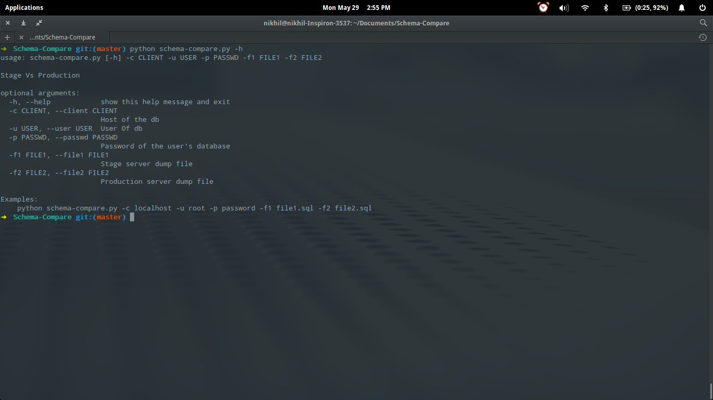
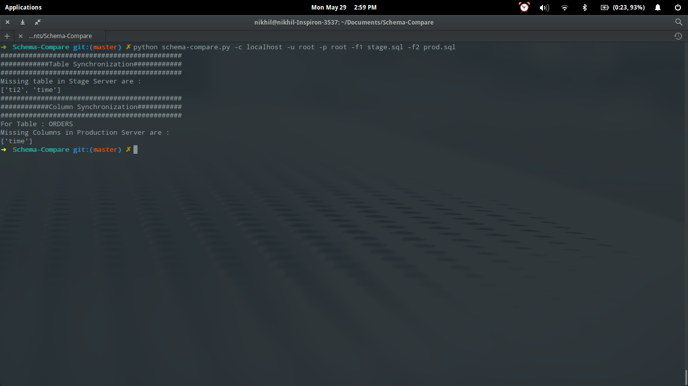

Compare Stage And Production Sql Server
==========

### Highlights:

1. Check for the consistency of tables in Stage and Production sql server.
2. Check for the consistency of columns of common tables in Stage and Production sql server.

### Needed Improvements:

1. We can connect this script with the front end to make it more useful.
2. This script can be used only for finding the inconsistency in table and column.

### Requirements

> python and mysql

> dump .sql file of stage and production

#### Local Setup 

In case if you are interesting in running this locally, please 

> git clone https://github.com/someone12321/SchemaCompare.git

> python schema-compare.py -h : For Help

> python schema-compare.py -c [localhost] -u [root] -p [password] -f1 [file1.sql] -f2 [file2.sql]

## Authors

* **Nikhil Mehandiratta** - *Initial work* - [someone12321](https://github.com/someone12321)